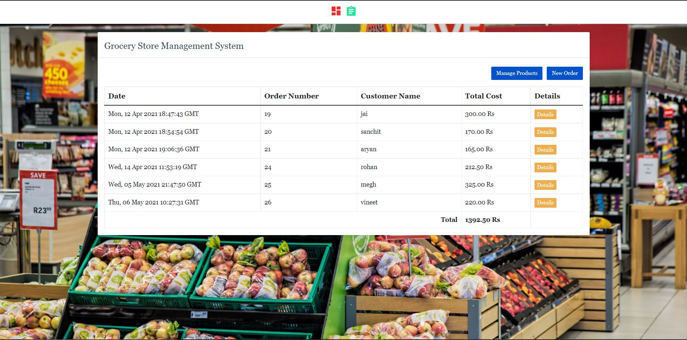

# python_projects_grocery_webapp
In this python project, we will build a grocery store management application. It will be 3 tier application,
1. Front end: UI is written in HTML/CSS/Javascript/Bootstrap
2. Backend: Python and Flask
3. Database: mysql

### Installation Instructions

Download mysql for windows: https://dev.mysql.com/downloads/installer/

`pip install mysql-connector-python`

### Exercise 

The grocery management system that we built is functional but after we give it to users for use, we got following feedback. The exercise for you to address this feedback and implement these features in the application,
1. Implement a new form that allows you to add new UOM in the application. For example you want to add **Cubic Meter** as a new UOM as the grocery store decided to start selling **wood** as well. This requies changing backend (python server) and fornt end (UI) both.
2. When you place an order it doesn't have any validation. For example one can enter an order with empty customer name. You need to add validation for customer name and invalid item name or not specifying a quantity etc. This is only front end UI work.
